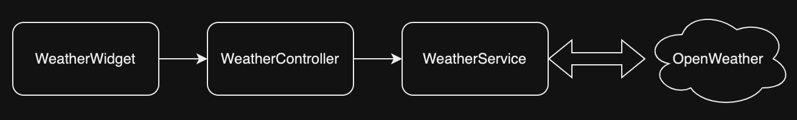

# flutter_weather

### [English](README.md), [中文](README.zh-tw.md)

This flutter weather project shows the weather information from OpenWeather service. It mainly demonstrates the use of openweather API, retrofit, and riverpod. Retrofit is a HTTP client library, and riverpod is a reactive caching and data-binding framework to take care of application's logic.

## Dependencies
   - [retrofit](https://pub.dev/packages/retrofit): A HTTP client library
   - [riverpod](https://pub.dev/packages/riverpod): A reactive caching and data-binding framework
   - [freezed](https://pub.dev/packages/freezed): Code generator for data classe
   - [go_router](https://pub.dev/packages/go_router): A declarative routing package for Flutter
   - [flutter_dotenv](https://pub.dev/packages/flutter_dotenv): Load configuration at runtime from a `.env` file

## How to Run
  1. Get OpenWeather API key
     - [Sign up to OpenWeather service](https://home.openweathermap.org/users/sign_up) to use free plan
  2. Clone source
     - git clone https://github.com/ethanlyko/flutter_weather.git
  3. Replace OpenWeather API key in evn.example file and rename it to .env
  4. Run it

## Overview
This project utilizes `riverpod` to handle state transitions. When weather query executes, ui widgets watch query result which is handled by riverpod mechanism.

